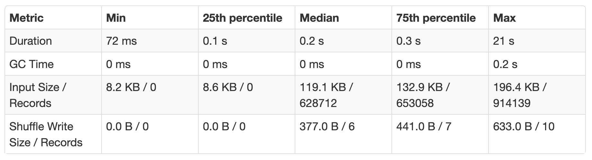

# Key/Partition Skew

Key or partition skew is a frequent problem in Spark. Key skew can result in everything from slowly running jobs (with stragglers), to failing jobs.

### What is data skew?

1. Usually caused during a transformation when the data in one partition ends up being a lot more than the others, bumping up memory could resolve an OOM error but does not solve the underlying problem

1. Processing partitions are unbalanced by a magnitude then the largest partition becomes the bottleneck

### How to identify skew

1. If one task took much longer to complete than the other tasks, it's usually a sign of Skew. On the Spark UI under Summary Metrics for completed tasks if the Max duration is higher by a significant magnitude from the Median it usually represents Skew, e.g.:

Things to consider

1. Mitigating skew has a cost (e.g. repartition) hence its ignorable unless the duration or input size is significantly higher in magnitude severely impacting job time

### Mitigation strategies

1. Increasing executor memory to prevent OOM exceptions -> This a short-term solution if you want to unblock yourself but does not address the underlying issue. Sometimes this is not an option when you are already running at the max memory settings allowable. 

1. Salting is a way to balance partitions by introducing a salt/dummy key for the skewed partitions. Here is a sample workbook and an example of salting in content performance show completion pipeline, where the whole salting operation is parametrized with a JOIN_BUCKETS variable which helps with maintenance of this job.

1. Isolate the data for the skewed key, broadcast it for processing (e.g. join) and then union back the results

1. Adaptive Query Execution is a new framework with Spark 3.0, it enables Spark to dynamically identify skew. Under the hood adaptive query execution splits (and replicates if needed) skewed (large) partitions. If you don’t want to wait for 3.0, you can build the solution into the code by using the Salting/Partitioning technique listed above.

1. Using approximate functions/ probabilistic data structure

1. Using approximate distinct counts (Hyperloglog) can help get around skew if absolute precision isn't important.

Approximate data structures like Tdigest can help with quantile computations.
If you need exact quantiles, check out the example in [High Performance Spark](https://amzn.to/3cmdRw9)

Certain types of aggregations and windows can result in partitioning the data on a particular key.
