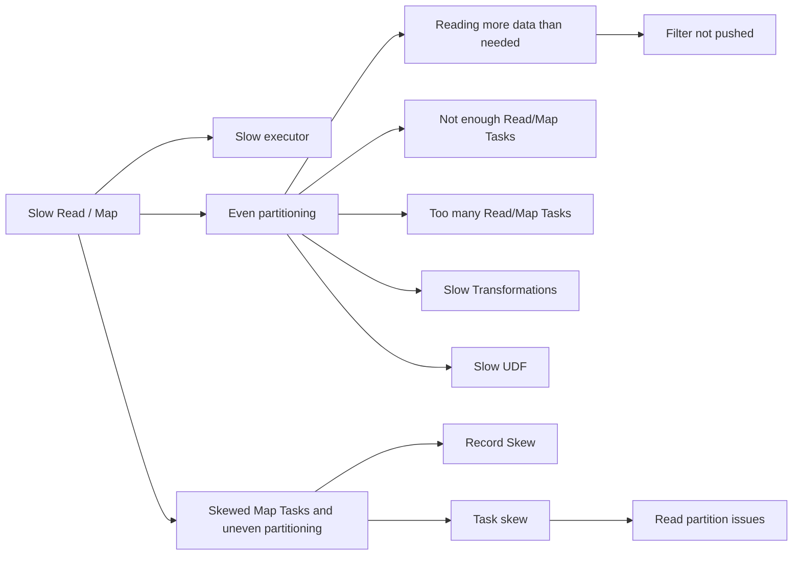

# Slow Map


Below is a list of reasons why your map stage might be slow. Note that this is not an exhaustive list but covers most of the scenarios.



### Reading more data than needed

Iceberg/Parquet provides 3 layers of data pruning/filtering, so it is recommended to make the most of it by utilizing them as upstream in your ETL as possible.

* Partition Pruning : Applying a filter on a partition column would mean the Spark can prune all the partitions that are not needed (ex: utc_date, utc_hour etc.). Refer to [this](./slow-partition_filter_pushdown.md) section for some examples.
* Column Pruning : Parquet, a columnar format, allows us to read specific columns from a row group without having to read the entire row. By selecting the fields that you only need for your job/sql(instead of "select *"), you can avoid bringing unnecessary data only to drop it in the subsequent stages.
* Predicate Push Down: It is also recommended to use filters on non-partition columns as this would allow Spark to exclude specific row groups while reading data from S3. For ex: ```account_id is not null``` if you know that you would be dropping the NULL account_ids eventually.

See also [filter not pushed down]("../../details/slow-partition_filter_pushdown"),  aggregation not pushed down(todo: add details), Bad storage partitioning(todo: add details).

### Not enough Read/Map Tasks

If your map stage is taking longer, and you are sure that you are not reading more data than needed, then you may be reading the data with small no. of tasks. You can increase the no. of map tasks by decreasing target split size. Note that if you are constrained by the resources(map tasks are just waiting for resources and not in RUNNING status), you would have to request more executors for your job by increasing ```spark.dynamicAllocation.maxExecutors```


### Too many Read/Map Tasks

If you have large no. of map tasks in your stage, you could run into driver memory related errors as the task metadata could overwhelm the driver. This also could put a stress on shuffle(on map side) as more map tasks would create more shuffle blocks. It is recommended to keep the task count for a stage under 80k.  You can decrease the no. of map tasks by increasing target split size (todo: add detail) for an Iceberg table. (Note: For a non-iceberg table, the property is ```spark.sql.maxPartitionBytes``` and it is at the job level and not at the table level)

### Slow Transformations

Another reason for slow running map tasks could be from many reason, some common ones include:

* Regex : You have `RegEx` in your transformation.  Refer to [RegEx tips](./slow-regex-tips.md) for tuning.
* udf: Make sure you are sending only the data that you need in UDF and tune UDF for performance. Refer to [Slow UDF](./udfslow.md) for more details.
* Json: TBD

All these transformations may run into skew issues if you have a [single row/column that is bloated.]() You could prevent this by checking the payload size before calling the transformation as a single row/column could potentially slow down the entire stage.


### Skewed Map Tasks or Uneven partitioning

The most common (and most difficult to fix) bad partitioning in Spark is that of skewed partitioning. The data is not evenly distributed amongst the partitions.

* Uneven partitioning due to Key-skew : The most frequent cause of skewed partitioning is that of ["key-skew."](../key-skew) This happens frequently since humans and machines both tend to cluster resulting in skew (e.g. NYC and `null`).

* Uneven partitioning due to input layout: We are used to thinking of partitioning after a shuffle, but partitioning problems can occur at read time as well. This often happens when the layout of the data on disk is not well suited to our computation. In cases where the RDD or Dataframe doesn't have a particular partitioner, data is partitioned according to the storage on disk. Uneven input partitioned data can be fixed with an explicit repartition/shuffle. Spark is often able to avoid input layout issues by combinding and splitting inputs (when input formats are "splittable"), but not all input formats give Spark this freedom. One common example is `gzip`, although there is a work-around for ["splittable gzip"](https://github.com/nielsbasjes/splittablegzip) but this comes at the cost of decompressing the entire file multiple times.

* Record Skew : A single bloated row/record could be the root cause for slow map task. The easiest way to identify this is by checking your string fields that has Json payload. ( Ex: A bug in a client could write a lot of data). You can identify the culprit by checking the max(size/length) of the field in your upstream table. For CL, `snapshot` is a candidate for bloated field.

* Task Skew : **This is only applicable to the tables with non-splittable file format(like TEXT, zip) and parquet files should never run into this issue. Task skew is where one of the tasks got more rows than others and it is possible  if the upstream table has a single file that is large and has the non-splittable format.

