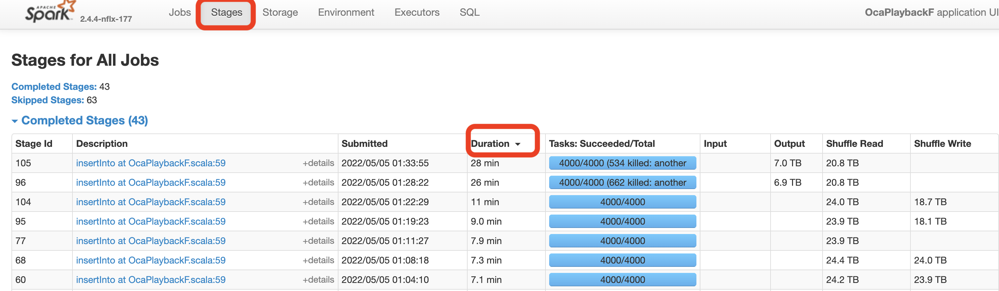

# Identify the slow stage

### When you have an event log from an earlier "good run"

You can compare the slow and the fast runs.
For this you can even use your local pyspark and calculate a ratio between slow and fast run for each stage metrics:

```
# Helper methods (just copy-paste it)

def createEventView(eventLogFile, eventViewName):
  sql("CREATE OR REPLACE TEMPORARY VIEW {} USING org.apache.spark.sql.json OPTIONS (path '{}')".format(eventViewName, eventLogFile))


def createStageMetricsView(eventViewName, stageMetricsViewName):
  sql("CREATE OR REPLACE TEMPORARY VIEW {} AS select `Submission Time`, `Completion Time`, `Stage ID`, t3.col.* from (select `Stage Info`.* from {} where Event='SparkListenerStageCompleted') lateral view explode(Accumulables) t3".format(stageMetricsViewName, eventViewName))


def showDiffInStage(fastStagesTable, slowStagesTable, stageID):
  sql("select {fastStages}.Name, {fastStages}.Value as Fast, {slowStages}.Value as Slow, {slowStages}.Value / {fastStages}.Value as `Slow / Fast` from {fastStages} INNER JOIN {slowStages} ON {fastStages}.ID = {slowStages}.ID where {fastStages}.`Stage ID` = {stageID} and {slowStages}.`Stage ID` = {stageID}".format(fastStages=fastStagesTable, slowStages=slowStagesTable, stageID=stageID)).show(40, False)


# Creating the views from the event logs (just an example, you have to specify your own paths)

createEventView("<path_to_the_fast_run_event_log>", "FAST_EVENTS")
createStageMetricsView("FAST_EVENTS", "FAST_STAGE_METRICS")

createEventView("<path_to_the_slow_run_event_log>", "SLOW_EVENTS")
createStageMetricsView("SLOW_EVENTS", "SLOW_STAGE_METRICS")

>>> sql("SELECT DISTINCT `Stage ID` from FAST_STAGE_METRICS").show()
+--------+
|Stage ID|
+--------+
|       0|
|       1|
|       2|
+--------+

>>> sql("SELECT DISTINCT `Stage ID` from SLOW_STAGE_METRICS").show()
+--------+
|Stage ID|
+--------+
|       0|
|       1|
|       2|
+--------+

>>> showDiffInStage("FAST_STAGE_METRICS", "SLOW_STAGE_METRICS", 2)
+-------------------------------------------+-------------+-------------+------------------+
|Name                                       |Fast         |Slow         |Slow / Fast       |
+-------------------------------------------+-------------+-------------+------------------+
|scan time total (min, med, max)            |1095931      |1628308      |1.485776020570638 |
|internal.metrics.executorRunTime           |7486648      |12990126     |1.735105750931525 |
|duration total (min, med, max)             |7017645      |12322243     |1.7558943206731032|
|internal.metrics.jvmGCTime                 |220325       |1084412      |4.921874503574266 |
|internal.metrics.output.bytesWritten       |34767744411  |34767744411  |1.0               |
|internal.metrics.input.recordsRead         |149652381    |149652381    |1.0               |
|internal.metrics.executorDeserializeCpuTime|5666230304   |7760682789   |1.3696377260771504|
|internal.metrics.resultSize                |625598       |626415       |1.0013059504665935|
|internal.metrics.executorCpuTime           |6403420405851|8762799691603|1.3684560963069305|
|internal.metrics.input.bytesRead           |69488204276  |69488204276  |1.0               |
|number of output rows                      |149652381    |149652381    |1.0               |
|internal.metrics.resultSerializationTime   |36           |72           |2.0               |
|internal.metrics.output.recordsWritten     |149652381    |149652381    |1.0               |
|internal.metrics.executorDeserializeTime   |6024         |11954        |1.9843957503320053|
+-------------------------------------------+-------------+-------------+------------------+
```

### When there is no event log from a good run

Steps: 

1. Navigate to Spark UI using spark history URL
2. Click on `Stages` and sort the stages(click on `Duration`) in descending order to find the longest running stage.

 


### Now let's figure out if the slow stage is a `Map` or `Reduce/Shuffle`


Once you identify the slow stage, check the fields "Input", "Output", "Shuffle Read", "Shuffle Write" of the slow stage and use below grid to identify the stage type and the corresponding ETL action.

```
 -----------------------------------------------------------------------------------
| Input | Output | Shuffle Read | Shuffle Write |  MR Stage  |  ETL Action          |
|------------------------------------------------------------|----------------------|
|   X   |        |              |       X       |    Map     |     Read             |
|------------------------------------------------------------|----------------------|
|   X   |    X   |              |               |    Map     |   Read/Write         |
|------------------------------------------------------------|----------------------|
|   X   |        |              |               |    Map     | Sort Estimate        |
|------------------------------------------------------------|----------------------|
|       |        |      X       |               |    Map     | Sort Estimate        |
|------------------------------------------------------------|----------------------|
|       |        |      X       |       X       |   Reduce   | Join/Agg/Repartition |
|------------------------------------------------------------|----------------------|
|       |    X   |      X       |               |   Reduce   |     Write            |
 ------------------------------------------------------------|----------------------
    

```


go to [Map](../slow-map) if the slow stage is from a Map operation.
go to [Reduce](../slow-reduce) if the slow stage is from a Reduce/Shuffle operation.


