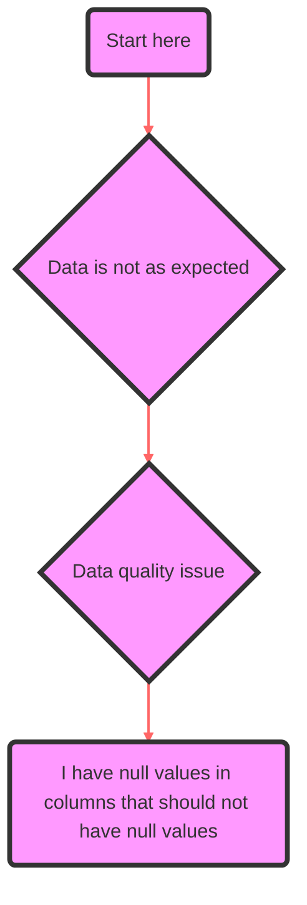

# Data Quality Issues Flowchart

For a detailed guide on handling unexpected null values in columns, please refer to [Handling Unexpected Null Values in Columns](../details/handle-unexpected-nulls.md).

Reference links:
- [Apache Spark StructType](https://github.com/apache/spark/blob/v2.1.0/sql/catalyst/src/main/scala/org/apache/spark/sql/types/StructType.scala#L379-L386)
- [Medium blog: Apache Spark, Parquet and Troublesome Nulls](https://medium.com/@weshoffman/apache-spark-parquet-and-troublesome-nulls-28712b06f836)
