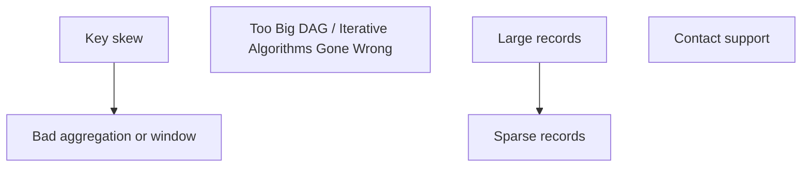

```mermaid
graph TD
KEYSKEW[Key skew]
BADAGGREGATE[Bad aggregation or window]
TOOBIGDAG[Too Big DAG / Iterative Algorithms Gone Wrong]
LARGERECORDS[Large records] --> ESPARSE[Sparse records]
ESPARSE[Sparse records]

KEYSKEW --> BADAGGREGATE
click KEYSKEW "../../details/key-skew" "Key skew"
click BADAGREGATE "../../details/bad-aggregate" "Bad aggregation"
click TOOBIGDAG "../../details/toobigdag" "Too big DAG (or when your iterative algorithms go wrong)"


OHNOES[Contact support]
```
<!-- two lines up is a special cell which ends the import into the "root" graph.-->
